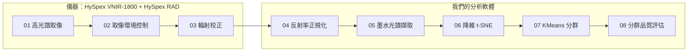

# HySpex 高光譜墨水鑑識：軟體附加服務方向與名詞解釋

這份文件整理出 11 項可以跟 HySpex VNIR-1800 一起提供的軟體服務，分成四類，並解釋文中用到的專有名詞。建議第一批先做三項：逐像素上色圖、「分不開」警示、可重現的鑑定報告。

## 儀器與軟體搭配的整體流程

一份文件從放上載台到得出「有沒有混用墨水」，共 8 個步驟：前 3 步由 HySpex 相機與它附的 HySpex RAD 完成，後 5 步由我們的分析軟體負責。流程依照論文的處理管線（論文 Fig. 3）。

| 步驟 | 做什麼 | 由誰負責 | 產出 |
| --- | --- | --- | --- |
| 01 高光譜取像 | 推掃式相機逐行掃描文件，400–1000 nm 共 186 個波段 | HySpex VNIR-1800 | 原始高光譜影像 |
| 02 取像環境控制 | 文件放在移動載台上，兩盞鹵素燈以 45° 照明，參考標準板一起入鏡 | 操作人員 | 條件一致、可換算反射率的影像 |
| 03 輻射校正 | 把原始讀值換算成絕對輻射亮度，修正感測器不均勻與暗電流 | HySpex RAD | 輻射亮度影像 |
| 04 反射率正規化 | 用參考標準板換算每個像素的絕對反射率，消除燈光強弱的影響 | 我們的軟體 | 反射率影像 |
| 05 墨水光譜擷取 | 從各墨水區塊取出光譜，整批一起分析 | 我們的軟體 | 一批光譜（每條 186 維） |
| 06 降維 | 用 t-SNE 把光譜壓成 2 維，相似的光譜會聚在一起 | 我們的軟體 | 2 維散點圖 |
| 07 KMeans 分群 | 在 2 維結果上把樣本分群 | 我們的軟體 | 每個樣本屬於哪一群 |
| 08 分群品質評估 | 計算 SI 等指標，判斷分群可不可信 | 我們的軟體 | 分群指標、鑑定結論 |

要注意：

- **第 08 步在真實案件只能用 SI。** NMI、HI、CI 都需要事先知道正確答案，只能在已知答案的測試資料上用來驗證方法（見下方名詞解釋）。

## 背景

依據的論文是 Melit Devassy & George，〈Dimensionality reduction and visualisation of hyperspectral ink data using t-SNE〉，*Forensic Science International* 311 (2020) 110194（[DOI](https://doi.org/10.1016/j.forsciint.2020.110194)）。

- 論文用 HySpex VNIR-1800 拍攝 60 支市售筆寫的字：25 支藍筆、20 支紅筆、15 支黑筆，每支筆取 50 條光譜。
- 結論是 t-SNE 在四項分群指標上都贏過 PCA，例如藍筆的 NMI 是 0.83 對 0.55。
- 論文要證明的是「這個方法能不能把不同墨水分開」，屬於方法驗證，不是一套可以直接上線的系統。以下各項服務，就是把它變成鑑識人員能實際使用、能帶上法庭的工具時，還缺的部分。

目前的網頁 demo 跑的是真實的 t-SNE、KMeans 與多種降維方法運算，但資料是合成的手寫圖片加 HOG 特徵，不是真的光譜；畫面上的硬體取像步驟只是示意動畫。

## 名詞解釋

### 儀器與取像

| 名詞 | 說明 |
| --- | --- |
| 高光譜影像（Hyperspectral Imaging, HSI） | 一般相機每個像素只記錄紅、綠、藍 3 個顏色；高光譜相機每個像素記錄上百個窄波段的亮度，等於每個像素都有一條完整光譜。 |
| 光譜（spectrum） | 一個物體在各個波長的反射強度所連成的曲線。不同成分的墨水，光譜形狀不同，就像指紋。 |
| 波段（band） | 光譜被切成的一小段波長範圍。HySpex VNIR-1800 有 186 個波段，每段約 3.18 nm。 |

### 資料分析與演算法

| 名詞 | 說明 |
| --- | --- |
| 降維（dimensionality reduction） | 把很多維的資料（例如一條 186 維的光譜）壓成 2 維或 3 維，讓人能畫成散點圖看，同時盡量保留樣本之間的相似關係。 |
| PCA（主成分分析） | 最經典的線性降維方法，找出資料變化最大的方向來投影。速度快、結果穩定，但抓不到彎曲（非線性）的結構。 |
| t-SNE | 非線性降維方法（van der Maaten & Hinton，2008），重點是讓「原本相近的樣本，降維後仍然相近」。擅長把群聚分得很開，但速度慢、有隨機性，而且不能直接把新樣本放進已算好的圖裡，每次都要整批重算。 |
| ICA（獨立成分分析） | 線性方法，把資料拆成彼此統計上獨立的訊號來源。 |
| LDA（線性判別分析） | 監督式線性方法，需要事先知道標籤才能算，所以不適合用來「找出」未知的混用墨水。 |
| MDS（多維尺度分析） | 非線性方法，盡量保持樣本兩兩之間的距離。 |
| Isomap | 非線性方法，沿著資料本身的形狀（鄰居連成的網）量距離，而不是走直線。 |
| Spectral Embedding（譜嵌入） | 非線性方法，先把相近的樣本連成網路圖，再依圖的結構排位置。 |
| UMAP | 較新的非線性降維方法，速度通常比 t-SNE 快。demo 目前沒有納入，因為需要另外安裝套件。 |
| KMeans | 分群演算法：先指定要分幾群（k），反覆「把每個點分給最近的群中心、再重算群中心」，直到不再變化。 |
| 群中心（centroid） | 一群所有點的平均位置。demo 裡 KMeans 動畫的黑色 X 就是群中心。 |
| HOG（方向梯度直方圖） | 描述圖片中線條方向分布的特徵。demo 用合成手寫圖片的 HOG 特徵，代替真實的光譜。 |

### 評估指標

四項指標都是對 KMeans 在降維結果上分出的群來算。

| 名詞 | 說明 |
| --- | --- |
| SI（輪廓係數，Silhouette Index） | 看每個點跟自己那群有多近、跟別群有多遠。範圍 −1 到 1，越高越好，接近 0 代表群跟群互相重疊。**不需要正確答案就能算**，所以真實案件也能用，demo 的自動挑選就只看它。 |
| NMI（標準化互資訊） | 衡量分群結果跟正確答案有多一致。範圍 0 到 1，1 代表完全一致。需要正確答案。 |
| HI（同質性，Homogeneity） | 每一群裡是不是只有同一種來源。範圍 0 到 1。需要正確答案。 |
| CI（完整性，Completeness） | 同一種來源的樣本，是不是都被分進同一群。範圍 0 到 1。需要正確答案。 |